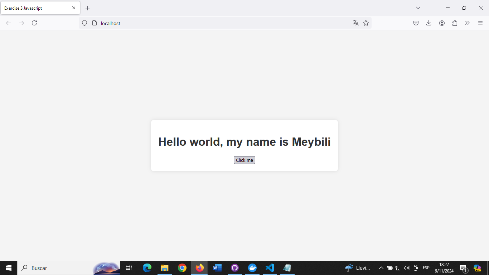

# JavaScript Project: exercise3javascript

This project is a simple web application built using HTML, CSS, and JavaScript, and containerized with Docker for deployment.

## Project Structure

- `index.html`: The main entry point of the web application, containing the HTML structure.
- `script.js`: The JavaScript file responsible for adding interactivity to the web page.
- `style.css`:  The CSS file used for styling the web page.
- `Dockerfile`: Defines how the Docker image is built.
- `README.md`: Project documentation and instructions for execution.
- `image.png`: Example image showing the project running.

## Prerequisites

Before running this project, you must have the following programs:

- **Docker**: To build and run the container. You can download Docker from [Docker Desktop](https://www.docker.com/products/docker-desktop).
- **Docker Hub Account**: To pull the project image directly from Docker Hub. Make sure you have an account and are logged in.

## Manual Execution from Code

1. **Download the Project from GitHub**:

   - Go to the repository on GitHub and click **"Code"**. Then select **"Download ZIP"** to download the project to your computer.
   - Unzip the ZIP file into a folder of your choice.

2. **Open a Terminal in the Project Folder**:

   - Navigate to the folder where you unzipped the project and go into the `exercise3javascript` project folder.
   - Open a terminal or command prompt (CMD) inside this folder. On Windows, you can right-click the folder and select **"Open PowerShell window here"**.

3. **Build the Docker Image**:

    Run the following command in the terminal to build the Docker image:
  
        docker build -t meybili/exercise3javascript .

4. **Run the Container for the Project**:

    Once the image has been built successfully, run the following command to start the container:
    
        docker run --name exercise3javascript -p 80:80 meybili/exercise3javascript

## Running from Docker Hub

1. **Pull the image from Docker Hub**:

    docker pull meybili/exercise3javascript:latest

2. **Run the container for the project**:

    docker run --name exercise3javascript -p 80:80 meybili/exercise3javascript

3. **Open your browser and navigate to http://localhost:80 to see the app.**

### Output Example

### Notes

- Make sure Docker is running.
- If you have problems accessing http://localhost:80, check that the port is not in use or check your firewall.

## Credits

This project was developed by Meybili Olivares (https://github.com/meybili19).